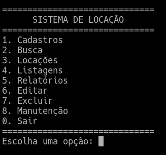
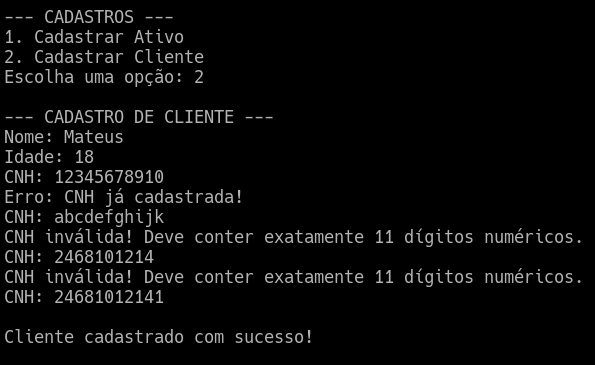
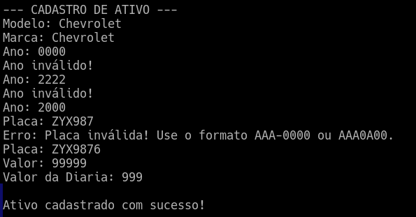
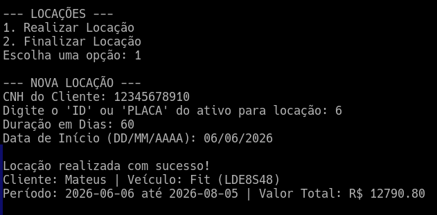
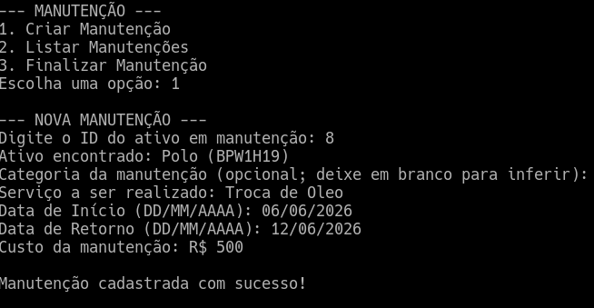

# LOCAR — Locação Organizada Com Automação e Rastramento


> Projeto acadêmico desenvolvido em Python para controlar veículos, clientes, locações, manutenções e relatórios financeiros de uma locadora.


---

## Sumário

- [Sobre o projeto](#sobre-o-projeto)
- [Problema que o sistema resolve](#problema-que-o-sistema-resolve)
- [Objetivo](#objetivo)
- [Principais elementos do sistema](#principais-elementos-do-sistema)
- [Estrutura de dados e banco](#estrutura-de-dados-e-banco)
- [Relações entre entidades](#relações-entre-entidades)
- [Regras de validação](#regras-de-validação)
- [Funcionalidades](#funcionalidades)
- [Relatórios](#relatórios)
- [Base de dados](#base-de-dados)
- [Estrutura do projeto](#estrutura-do-projeto)
- [Como executar](#como-executar)
- [Demonstração prática](#demonstração-prática)
- [Melhorias em Relação ao Projeto 2](#melhorias-em-relacao-ao-projeto-2)
- [Autores](#autores)

---

## Sobre o projeto

O **LOCAR** é um sistema de locação de veículos feito em **Python**, com persistência de dados em **SQLite**.  
Ele funciona por menu no terminal e permite que uma locadora controle seus principais processos: cadastro de veículos, cadastro de clientes, locações, manutenções, consultas e relatórios.

A proposta do projeto é simular um sistema simples, mas completo, usando conceitos fundamentais de programação, modelagem de dados e relacionamento entre entidades.

---

## Problema que o sistema resolve

Pequenas locadoras podem ter dificuldade para controlar manualmente:

- quais veículos estão disponíveis;
- quais veículos estão alugados;
- quais veículos estão em manutenção;
- quais clientes possuem locações ativas;
- quais valores entram por locações;
- quais custos saem por manutenção;
- quais dados já foram cadastrados.

O sistema resolve esse problema centralizando essas informações em uma aplicação com banco de dados, evitando duplicidade de dados e bloqueando operações inválidas.

---

## Objetivo

O objetivo do sistema é permitir que uma locadora consiga:

- cadastrar veículos e clientes;
- consultar veículos por ID ou placa;
- consultar clientes por ID ou CNH;
- realizar locações;
- finalizar locações;
- controlar disponibilidade dos veículos;
- registrar manutenções;
- impedir locações inválidas;
- calcular valores de locação;
- calcular depreciação de ativos;
- gerar relatórios operacionais e financeiros.

---

## Principais elementos do sistema

| Elemento | Representação | Função no sistema |
|---|---|---|
| Cliente | `Cliente` / tabela `clientes` | Pessoa cadastrada que pode alugar um veículo. |
| Ativo | `Ativo` / tabela `ativos` | Veículo pertencente à locadora. |
| Locação | `Locacao` / tabela `locacao` | Registro que liga um cliente a um veículo alugado. |
| Manutenção | `Manutencao` / tabela `manutencao` | Registro de manutenção feita em um veículo. |

---

## Estrutura de dados e banco

O projeto utiliza uma combinação de **classes Python**, **listas**, **dicionários** e **SQLite**.

### Classes

As classes representam os principais elementos do domínio:

```text
modelos/ativo.py
modelos/cliente.py
modelos/locacao.py
modelos/manutencao.py
```

Elas ajudam a organizar os dados de cada entidade e deixam o sistema mais próximo de uma modelagem orientada a objetos.

### Dicionários

As consultas ao banco retornam dados convertidos em dicionários.  
Isso facilita o acesso aos campos pelo nome:

```python
ativo['placa']
cliente['cnh']
locacao['status']
```

### Listas de dicionários

Listagens como clientes, ativos, locações e manutenções retornam uma lista de registros:

```python
[
    {'id_ativo': 1, 'modelo': 'Civic', 'placa': 'ABC1D23'},
    {'id_ativo': 2, 'modelo': 'Onix', 'placa': 'QWE8R91'}
]
```

Essa estrutura é útil porque o sistema precisa percorrer vários registros para exibir relatórios e listagens.

### SQLite

O SQLite foi usado porque permite persistir os dados em arquivo, sem depender de um servidor externo de banco de dados.

Arquivo principal do banco:

```text
dados/databank.db
```

---

## Relações entre entidades

O sistema possui relações diretas entre as tabelas principais.

### Cliente e Locação

Um cliente pode ter várias locações ao longo do tempo, mas o sistema impede que ele tenha mais de uma locação ativa ao mesmo tempo.

```text
Cliente 1:N Locação
```

### Ativo e Locação

Um veículo pode aparecer em várias locações históricas, mas só pode estar em uma locação ativa por vez.

```text
Ativo 1:N Locação
```

### Ativo e Manutenção

Um veículo pode ter vários registros de manutenção ao longo do tempo.

```text
Ativo 1:N Manutenção
```

### Locação como tabela de ligação

A tabela `locacao` conecta:

- `id_cliente`
- `id_ativo`
- `data_ini`
- `duracao`
- `data_fim`
- `valor`
- `status`

Ela representa a relação entre cliente e veículo no momento do aluguel.

---

## Regras de validação

O sistema possui validações importantes para evitar dados inconsistentes.

### Cliente

- O cliente precisa ter idade maior ou igual a 18 anos.
- A CNH precisa ser numérica.
- A CNH não pode estar duplicada.

### Ativo

- A placa precisa seguir um formato válido.
- A placa não pode estar duplicada.
- O ano do veículo precisa estar entre 1900 e o ano atual.
- O valor do veículo precisa ser maior que zero.
- O valor da diária precisa ser maior que zero.

### Locação

- A duração da locação precisa ser maior que zero.
- O veículo precisa estar disponível para ser alugado.
- Um veículo alugado não pode ser alugado novamente.
- Um cliente com locação ativa não pode iniciar outra locação.
- O valor total da locação é calculado pela diária multiplicada pela duração.

### Manutenção

- Um ativo alugado não pode entrar em manutenção.
- Um ativo em manutenção não pode ser apagado.
- Um ativo alugado não pode ser apagado.
- A manutenção fica vinculada a um veículo existente.

---

## Funcionalidades

O sistema possui um menu principal com as seguintes áreas:

```text
1. Cadastros
2. Busca
3. Locações
4. Listagens
5. Relatórios
6. Editar
7. Excluir
8. Manutenção
0. Sair
```

### Cadastros

- Cadastrar ativo.
- Cadastrar cliente.

### Busca

- Buscar ativo por ID ou placa.
- Buscar cliente por ID ou CNH.
- Buscar locação por ID.
- Buscar manutenção por ID.

### Locações

- Realizar locação.
- Finalizar locação.

### Listagens

- Listar ativos.
- Listar clientes.
- Listar locações.
- Listar manutenções.

### Edição

- Editar ativo.
- Editar cliente.

### Exclusão

- Excluir ativo.
- Excluir cliente.
- Excluir manutenção.

### Manutenção

- Criar manutenção.
- Listar manutenções.
- Finalizar manutenção.

---

## Relatórios

O sistema possui relatórios operacionais e financeiros.

### Relatórios operacionais

- Ativos disponíveis.
- Ativos alugados.
- Clientes com locação ativa.
- Manutenções ativas e finalizadas.

### Relatório financeiro

O relatório financeiro considera entradas e saídas:

| Tipo | Origem |
|---|---|
| Entrada | Valores recebidos por locações. |
| Saída | Custos registrados em manutenções. |

O sistema pode gerar relatório:

- mensal;
- anual.

Exemplo de cálculo financeiro:

```python
renda_liquida = entradas - saidas
```

---

## Base de dados

O banco utilizado no projeto é:

```text
dados/databank.db
```

### Tabelas principais

| Tabela | Descrição | Quantidade atual |
|---|---|---:|
| `ativos` | Veículos cadastrados no sistema | 100 |
| `clientes` | Clientes cadastrados para locação | 100 |
| `locacao` | Registros de locações realizadas | 100 |
| `manutencao` | Registros de manutenção dos veículos | 100 |

### Observação sobre os dados fictícios

A base foi populada com dados fictícios para demonstração do sistema.  
As placas e CNHs foram geradas de forma aleatória, evitando sequências simples como `LOC0001`, `LOC0002` ou `CNH000001`.

### Status dos ativos na base atual

| Status | Quantidade |
|---|---:|
| Disponível | 55 |
| Alugado | 28 |
| Manutenção | 17 |

### Status das locações

| Status | Quantidade |
|---|---:|
| Ativa | 28 |
| Finalizada | 72 |

---

## Estrutura do projeto

```text
Sistema-de-gestao-de-ativos/
├── controle/
│   ├── ativo_controle.py
│   ├── cliente_controle.py
│   ├── locacao_controle.py
│   └── manutencao_controle.py
├── dados/
│   ├── databank.db
│   ├── database.py
│   └── relatorios.py
├── imagens/
│   ├── demonstracao/
│   │   ├── execucao-cadastro-ativo.png
│   │   ├── Execucao-Cadastro-Cliente.png
│   │   ├── execucao-locacao.png
│   │   ├── Execucao-Main-1.png
│   │   └── execucao-manutencao.png    
│   ├── Banner.png
│   └── Profile.png
├── modelos/
│   ├── ativo.py
│   ├── cliente.py
│   ├── locacao.py
│   └── manutencao.py
├── main.py
└── README.md
```

### Organização das pastas

| Pasta/arquivo | Responsabilidade |
|---|---|
| `main.py` | Menu principal e fluxo de navegação do sistema. |
| `modelos/` | Classes que representam as entidades do sistema. |
| `controle/` | Regras de interação, validação e chamadas ao banco. |
| `dados/database.py` | Criação das tabelas e operações com SQLite. |
| `dados/relatorios.py` | Relatórios operacionais e financeiros. |
| `dados/databank.db` | Banco SQLite com os registros do sistema. |

---

## Como executar

### 1. Clonar ou baixar o projeto

Baixe o projeto e acesse a pasta principal:

```bash
cd Sistema-de-gestao-de-ativos
```

### 2. Executar o sistema

```bash
python main.py
```

Dependendo da instalação do Python, também pode ser necessário usar:

```bash
python3 main.py
```

### 3. Usar pelo menu

Depois de executar, o sistema exibirá o menu no terminal:

```text
==============================
      SISTEMA DE LOCAÇÃO
==============================
1. Cadastros
2. Busca
3. Locações
4. Listagens
5. Relatórios
6. Editar
7. Excluir
8. Manutenção
0. Sair
==============================
```

---

## Demonstração prática

### Tela inicial

A tela inicial apresenta todas as funcionalidades disponíveis no sistema, permitindo acesso às operações de cadastro, busca, locação, manutenção e relatórios.

**Imagem da execução:**



---

### Cadastro de cliente

Nesta etapa é realizado o cadastro de um novo cliente. O sistema valida idade mínima, CNH e duplicidade de registros.

**Imagem da execução:**




---

### Cadastro de ativo

O cadastro de ativos registra os veículos disponíveis para locação, validando placa, ano, valor de mercado e valor da diária.

**Imagem da execução:**



---

### Realização de locação

O sistema verifica a disponibilidade do veículo e a situação do cliente antes de criar a locação.

**Imagem da execução:**




---

### Registro de manutenção

Permite registrar custos de manutenção e alterar temporariamente a disponibilidade do ativo.

**Imagem da execução:**



---


### Fluxo básico de funcionamento

1. O operador cadastra um cliente.
2. O sistema valida idade e CNH.
3. O operador cadastra um veículo.
4. O sistema valida ano, placa, valor e diária.
5. O operador realiza uma locação.
6. O sistema verifica se o cliente e o veículo podem participar da locação.
7. O valor total é calculado automaticamente.
8. O veículo passa para o status `Alugado`.
9. Ao finalizar a locação, o veículo volta para `Disponível`.

---

## Melhorias em Relação ao Projeto 2

O Projeto 4 foi desenvolvido a partir da base criada no Projeto 2. Nesta nova etapa, o sistema foi ampliado e reorganizado para se aproximar mais de uma aplicação real de gestão de locações.

### Funcionalidades reaproveitadas

Foram mantidas as funcionalidades essenciais desenvolvidas anteriormente:

* Cadastro de clientes;
* Cadastro de ativos (veículos);
* Operações básicas de consulta;
* Estrutura principal do sistema de locação.

### Melhorias implementadas

Nesta versão foram realizadas diversas melhorias estruturais e funcionais:

#### Persistência de dados com SQLite

Os dados passaram a ser armazenados em banco de dados SQLite, permitindo salvar informações permanentemente entre execuções do sistema.

#### Ampliação da base de dados

O sistema passou a contar com mais de 100 registros em cada uma das principais entidades, permitindo consultas, testes e relatórios mais consistentes.

#### Implementação de relacionamentos

Foram modeladas relações entre as entidades do sistema:

* Cliente → Locação (1:N)
* Ativo → Locação (1:N)
* Ativo → Manutenção (1:N)

#### Regras de validação

Foram adicionadas validações para garantir a integridade dos dados:

* Verificação de CNH;
* Validação de placas;
* Controle de disponibilidade dos ativos;
* Bloqueio de operações inválidas.

#### Controle de manutenção

Foi criada uma área específica para registrar e acompanhar manutenções dos veículos.

#### Relatórios financeiros

O sistema passou a gerar relatórios financeiros com base nos valores cadastrados nas locações e nos custos de manutenção.

#### Representação matemática

Foram incorporados cálculos relacionados à operação da locadora:

* Valor total das locações;
* Receita acumulada;
* Custos de manutenção;
* Resultado financeiro;
* Depreciação de ativos.

### Resultado da evolução do projeto

O sistema evoluiu de uma aplicação com funcionalidades básicas para uma solução mais completa, capaz de armazenar dados, controlar processos, aplicar regras de negócio e gerar informações úteis para análise e tomada de decisão.

---

## Autores

- Giovanni Bruno Giovanelli
- Lucas Gabriel Genovezi
- Mateus Henrique Oliveira Vieira
- Thiago Henrique Bonierski
